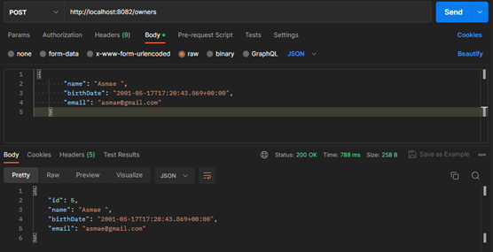
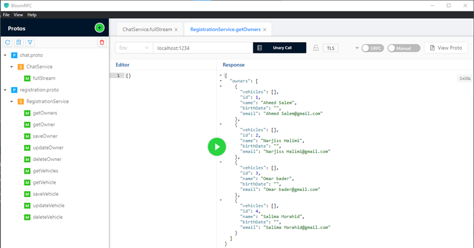
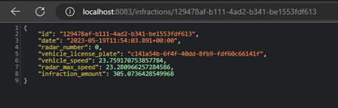

<h1>"Automated Management of Vehicle Speeding Offenses Detected by Automatic Radars."  With micro service</h1>

  Asmae EL HYANI  Distributed System & Artificial Intelligence Master’s  ENSET Mohammedia

   
<h2>About</h2>
<h4>Project architect and diagram of classes.</h4>

<ol type="I">
    <h2><li>Registration Micro Service</li></h2>

</ol>
<ol type="1">
    <h3><li>JPA Entities</li></h3>
<h6>-Owner class</h6>
<pre>
@Entity
@Data @NoArgsConstructor @AllArgsConstructor @Builder
public class Owner {
    @Id @GeneratedValue(strategy = GenerationType.IDENTITY)
    private Long id;
    private String name;
    private Date birthDate;
    private String email;
    @OneToMany(mappedBy = "owner")
    @JsonProperty(access = JsonProperty.Access.WRITE_ONLY)
    private List<.Vehicle> vehicles;
}
</pre>
<h6>-Vehicle class</h6>
<pre>
@Entity
@Data @NoArgsConstructor @AllArgsConstructor @Builder
public class Vehicle {
    @Id
    private String id;
    private String licensePlateNumber;
    private String brand;
    private double fiscalPower;
    private String model;
    @ManyToOne
    private Owner owner;
}
</pre>
<h3><li>Application class</li></h3>

Create owners and vehicle and stock them.

<pre>
@SpringBootApplication
public class MicroServiceProjectApplication {
	public static void main(String[] args) {
		SpringApplication.run(MicroServiceProjectApplication.class, args);
	}
	@Bean
	CommandLineRunner start(OwnerRepository ownerRepository, VehicleRepository vehicleRepository){
		return args -> {
			Stream.of("Ahmed Salem","Narjiss Halimi","Omar bader","Salima Morahid").forEach(c->{
				Owner owner=Owner.builder()
						.name(c)
						.birthDate(new Date())
						.email(c.trim()+"@gmail.com")
						.build();
				ownerRepository.save(owner);
			});
			ownerRepository.findAll().forEach(proprietaire -> {
				for(int i=0;i<3;i++){
					Vehicle vehicle=Vehicle.builder()
							.id(UUID.randomUUID().toString())
							.brand("brand"+(i+1))
							.model("model"+(i+1))
							.licensePlateNumber(UUID.randomUUID().toString())
							.owner(proprietaire)
							.fiscalPower(Math.random()*100)
							.build();
					vehicleRepository.save(vehicle);
				}
			});
			vehicleRepository.findAll().forEach(vehicle -> {
				System.out.println(vehicle.getOwner().getName());
			});
		};
	}
}
</pre>

<h3><li>RestFull</li></h3>
<h6>-Registration rest controller</h6>
<pre>
@RestController
public class RegistrationRestController {
    private OwnerRepository ownerRepository;
    private VehicleRepository vehicleRepository;
    private VehicleServiceImpl vehicleService;
    public RegistrationRestController(OwnerRepository ownerRepository, VehicleRepository vehicleRepository,VehicleServiceImpl vehicleService){
        this.ownerRepository=ownerRepository;
        this.vehicleRepository = vehicleRepository;
        this.vehicleService=vehicleService;
    }
    @GetMapping("/owners")
    public List<.Owner> proprietaires(){
        return ownerRepository.findAll();
    }
    @GetMapping("/owners/{id}")
    public Owner owner(@PathVariable Long id){
        return ownerRepository.findById(id).orElseThrow();
    }
    @PostMapping("/owners")
    public Owner save(@RequestBody Owner owner){
        return ownerRepository.save(owner);
    }
    @PutMapping("/owners/{id}")
    public Owner update(@PathVariable Long id, @RequestBody Owner owner){
        Owner owner1=ownerRepository.findById(id).orElseThrow();
        if(owner.getName()!=null) owner1.setName(owner.getName());
        if(owner.getEmail()!=null) owner1.setEmail(owner.getEmail());
        if(owner.getVehicles()!=null) owner1.setVehicles(owner.getVehicles());
        if(owner.getBirthDate()!=null) owner1.setBirthDate(owner.getBirthDate());
        return ownerRepository.save(owner1);
    }
    @DeleteMapping("/owners/{id}")
    public void delete(@PathVariable Long id){
        ownerRepository.deleteById(id);
    }
    //Four vehicles
    @GetMapping("/vehicles")
    public List<.Vehicle> vehicles(){
        return vehicleRepository.findAll();
    }
    @GetMapping("/vehicles/{id}")
    public Vehicle vehicle(@PathVariable String id){
        return vehicleRepository.findById(id).orElseThrow();
    }
    @PostMapping("/vehicles")
    public Vehicle save(@RequestBody Vehicle vehicle){
        return vehicleRepository.save(vehicle);
    }
    @PutMapping("/vehicles/{id}")
    public VehicleResponseDTO update(@PathVariable String id, @RequestBody VehicleRequestDTO vehicle){
        return vehicleService.update(id,vehicle);
        /*Vehicle v=vehicleRepository.findById(id).orElseThrow();
        if(vehicle.getModel()!=null) v.setModel(vehicle.getModel());
        if(vehicle.getBrand()!=null) v.setBrand(vehicle.getBrand());
        if(vehicle.getLicensePlateNumber()!=null) v.setLicensePlateNumber(vehicle.getLicensePlateNumber());
        v.setFiscalPower(vehicle.getFiscalPower());
        return vehicleRepository.save(v);*/
    }
    @DeleteMapping("/vehicles/{id}")
    public void delete(@PathVariable String id){
        vehicleRepository.deleteById(id);
    }
}
</pre>
<h3><li>Test with Postman</li></h3>
<h6>-Get owners</h6>
 
<h6>-Add owner</h6>
 
<h6>-Get owner 4</h6>
 
<h6>-Delete owner 5</h6>
 

<h3><li>GraphQL</li></h3>
<h6>-Registration Graphql Controller</h6>
<pre>
@Controller
@AllArgsConstructor
public class RegistrationGraphqlController {
    private OwnerRepository ownerRepository;
    private VehicleRepository vehicleRepository;
    private VehicleServiceImpl vehicleService;

    @QueryMapping
    public List<.Owner> owners() {
        return ownerRepository.findAll();
    }

    @QueryMapping
    public Owner ownerById(@Argument Long id) {
        return ownerRepository.findById(id).get();
    }

    @MutationMapping
    public Owner saveOwner(@Argument Owner owner) {
        return ownerRepository.save(owner);
    }

    /////////////////////////////////////////////

    @QueryMapping
    public List<.Vehicle> vehicles() {
        return vehicleRepository.findAll();
    }

    @QueryMapping
    public Vehicle vehicleById(@Argument String id) {
        return vehicleRepository.findById(id).get();
    }

    @MutationMapping
    public VehicleResponseDTO addVehicle(@Argument VehicleRequestDTO vehicle) {
        return vehicleService.addVehicle(vehicle);
    }

    @MutationMapping
    public VehicleResponseDTO updateVehicle(@Argument String id, @Argument VehicleRequestDTO vehicle) {
        return vehicleService.update(id,vehicle);
    }

    @MutationMapping
    public boolean deleteVehicle(@Argument String id) {
        vehicleRepository.deleteById(id);
        return true;
    }
}
</pre>
<h6>-Graphql schema</h6>
<pre>
type Query {
    vehicles : [Vehicle],
    vehicleById(id:String) : Vehicle,
    owners:[Owner]
}

type Mutation{
    addVehicle(vehicle : VehicleDTO) : Vehicle,
    addOwner(owner:OwnerDTO):Owner,
    updateVehicle(id : String,vehicle : VehicleDTO):Vehicle,
    deleteVehicle(id : String) : Boolean
}
type Owner{
    id:ID,
    name:String,
    birthDate:String,
    email:String,
    vehicles:[Vehicle]
}

type Vehicle{
    id : String,
    licensePlateNumber : String,
    brand : String,
    fiscalPower:Float,
    model:String,
    owner:Owner
}
input VehicleDTO {
    licensePlateNumber : String,
    brand : String,
    model:String,
    fiscalPower:Float,
    #owner: OwnerDTO
}
input OwnerDTO{
    name:String,
    email:String
}
</pre>
<h3><li>Test with graphiql</li></h3>
<h6>-Get owners and their vehicles</h6>

<h6>-Get vehicles</h6>

<h6>-Get vehicle by id </h6>

<h6>-Delete vehicle "2135b840-18d2-4281-919f-8e11050fe4f8"</h6>

<h6>-Add vehicle</h6>

<h6>-Update vehicle</h6>

<h3><li>Grpc</li></h3>
<h6>-Grpc controller</h6>
<pre>
@GrpcService
@AllArgsConstructor
public class RegistrationGrpcController extends RegistrationServiceGrpc.RegistrationServiceImplBase {
    private final OwnerRepository ownerRepository;
    private final VehicleRepository vehicleRepository;

    @Override
    public void getOwners(Registration.Empty request, StreamObserver<.Registration.OwnerList> responseObserver) {
        Collection<.Owner> owners = ownerRepository.findAll();
        Registration.OwnerList.Builder response = Registration.OwnerList.newBuilder();
        for (Owner owner : owners) {
            Registration.Owner ownerResponse = Registration.Owner.newBuilder()
                    .setId(owner.getId().intValue())
                    .setName(owner.getName())
                    .setEmail(owner.getEmail())
                    .build();
            response.addOwners(ownerResponse);
        }
        responseObserver.onNext(response.build());
        responseObserver.onCompleted();
    }
    @Override
    public void getOwner(Registration.OwnerId request, StreamObserver<.Registration.Owner> responseObserver) {
        Long ownerId = (long)request.getId();
        Owner owner = ownerRepository.findById(ownerId).orElse(null);
        Registration.Owner ownerResponse = Registration.Owner.newBuilder()
                .setId(owner.getId().intValue())
                .setName(owner.getName())
                .setEmail(owner.getEmail())
                .build();
        responseObserver.onNext(ownerResponse);
        responseObserver.onCompleted();
    }
}
</pre>
<h6>-Proto file</h6>
<pre>
syntax = "proto3";

option java_package = "ma.sdia.micro_service_project.web.grpc.stubs";

service RegistrationService {
  rpc getOwners(Empty) returns (OwnerList);
  rpc getOwner(OwnerId) returns (Owner);
  rpc saveOwner(OwnerRequest) returns (Owner);
  rpc updateOwner(OwnerUpdateRequest) returns (Owner);
  rpc deleteOwner(OwnerId) returns (Empty);

  rpc getVehicles(Empty) returns (VehicleList);
  rpc getVehicle(VehicleId) returns (Vehicle);
  rpc saveVehicle(VehicleRequest) returns (Vehicle);
  rpc updateVehicle(VehicleUpdateRequest) returns (Vehicle);
  rpc deleteVehicle(VehicleId) returns (Empty);
}

message OwnerUpdateRequest{
  int32 id = 1;
  string name = 2;
  string birthDate = 3;
  string email = 4;
}

message VehicleUpdateRequest{
  string id = 1;
  string licensePlateNumber = 2;
  string brand = 3;
  float fiscalPower = 4;
  string model = 5;
}

message OwnerId{
  int32 id = 1;
}

message VehicleId{
  string id = 1;
}

message OwnerRequest {
  string name = 1;
  string email = 3;
  string birthDate = 2;
}

message VehicleRequest {
  string licensePlateNumber = 1;
  string brand = 2;
  float fiscalPower = 3;
  string model = 4;
}

message Empty{}

message OwnerList {
  repeated Owner owners = 1;
}

message VehicleList{
  repeated Vehicle vehicles = 1;
}

message Owner {
  int32 id = 1;
  string name = 2;
  string birthDate = 3;
  string email = 4;
  repeated Vehicle vehicles = 5;
}

message Vehicle{
  string id = 1;
  string licensePlateNumber = 2;
  string brand = 3;
  float fiscalPower = 4;
  string model = 5;
  Owner owner = 6;
}
</pre>
<h3><li>Test with BloomRPC</li></h3>
<h6>-Get owners</h6>

<h6>-Get Owner by id</h6>

<h6>-code-</h6>
https://github.com/AsmaeEl23/micro_service_registration
</ol>

<ol type="I" start="2">
    <h2><li>Infraction Micro Service</li></h2>

</ol>
<ol type="1">
    <h3><li>JPA Entities</li></h3>
<h6>-Infraction class</h6>
<pre>
@Entity
@Data @NoArgsConstructor @AllArgsConstructor  @Builder
public class Infraction {
    @Id
    private String id;
    private Date date;
    private Long radarId;
    private String vehicle_license_plate;
    private double vehicle_speed;
    private double radar_max_speed;
    private double infraction_amount;
}
</pre>
<h3><li>Web service</li></h3>
<h6>-Restfull controller</h6>
<pre>
@RestController
public class InfractionRestController {
    @Autowired
    private InfractionRepository infractionRepository;
    @GetMapping("/infractions")
    public List<.Infraction> infractions(){
        return infractionRepository.findAll();
    }
    @GetMapping("/infractions/{id}")
    public Infraction infraction(@PathVariable String id){
        return infractionRepository.findById(id).orElseThrow();
    }
    @GetMapping("/infractions/radar/{id}")
    List<.Infraction> getInfractionsByRadarId(@PathVariable("id") Long id){
        return infractionRepository.findByRadarId(id);
    }
    @PostMapping("/infractions")
    public Infraction save(@RequestBody Infraction infraction){
        return infractionRepository.save(infraction);
    }
    @PutMapping("/infractions/{id}")
    public Infraction update(@PathVariable String id, @RequestBody Infraction infraction){
        Infraction infraction1=infractionRepository.findById(id).orElseThrow();
        if(infraction1!=null) {
            infraction.setId(id);
            return infractionRepository.save(infraction);
        }
        return null;
    }
    @DeleteMapping("/infractions/{id}")
    public void delete(@PathVariable String id){
        infractionRepository.deleteById(id);
    }
}

</pre>
<h3><li>Application class</li></h3>
<pre>
@SpringBootApplication
public class MicroServiceInfractionsApplication {
	public static void main(String[] args) {
		SpringApplication.run(MicroServiceInfractionsApplication.class, args);
	}
	@Bean
	CommandLineRunner start(InfractionRepository infractionRepository){
		return args -> {
			for(int i=0;i<3;i++){
				double nb=Math.random()*100;
				Infraction infraction=Infraction.builder()
						.infraction_amount(Math.random()*1000)
						.date(new Date())
						.id(UUID.randomUUID().toString())
						.radar_max_speed(nb)
						.vehicle_license_plate(UUID.randomUUID().toString())
						.vehicle_speed(nb+Math.random()*10)
						.build();
				infractionRepository.save(infraction);
			}
		};
	}
}
</pre>
 
<h3><li>Test with Postman</li></h3>
<h6>-Get infraction</h6>
 
<h6>-Get infraction by id</h6>
 
<h6>-Add infraction</h6>
 

<h6>-code-</h6>
https://github.com/AsmaeEl23/micro-service-Infractions
</ol>

<!-- ----------------------------------->
<ol type="I" start="3">
    <h2><li>Test Gateway</li></h2>

</ol>
<!-- ----------------------------------->

<ol type="I" start="4">
    <h2><li>Radar Micro Service</li></h2>

</ol>
<ol type="1">
    <h3><li>JPA Entities</li></h3>
<h6>-Owner class</h6>

<h6>-code-</h6>
https://github.com/AsmaeEl23/radar-service
</ol>

<!-- ----------------------------------->

<ol type="I" start="5">
    <h2><li>Client</li></h2>
<h6>-Main class</h6>
<pre>
public class Main {
    private static RadarServiceGrpc.RadarServiceBlockingStub stub;
    public static void main(String[] args) {
        ManagedChannel channel = ManagedChannelBuilder.forAddress("localhost", 1234)
                .usePlaintext()
                .build();
        stub = RadarServiceGrpc.newBlockingStub(channel);
        Scanner sc = new Scanner(System.in);
        // Detect infraction
        int choice = 0;
        while(choice != 2) {
            System.out.println("\n1. Detect infraction");
            System.out.println("2. Exit");
            System.out.print("Enter your choice: ");
            choice = sc.nextInt();
            switch (choice) {
                case 1:
                    System.out.print("Enter radar id: ");
                    Long radarId = sc.nextLong();
                    System.out.print("Enter vehicle speed: ");
                    Double speed = sc.nextDouble();
                    System.out.print("Enter vehicle id: ");
                    String vehicleId = sc.next();
                    System.out.println("Detecting infraction...");
                    Radar.DetectRequest request = Radar.DetectRequest.newBuilder()
                            .setRadarId(radarId)
                            .setVehicleId(vehicleId)
                            .setSpeed(speed)
                            .build();
                    stub.detectInfraction(request);
                    break;
                case 2:
                    System.out.println("Exiting...");
                    break;
                default:
                    System.out.println("Invalid choice");
            }
        }
    }
}
</pre>
</ol>
<ol type="1">
    <h3><li>JPA Entities</li></h3>
<h6>-Owner class</h6>

<h6>-code-</h6>
https://github.com/AsmaeEl23/grpc_radar_client
</ol>